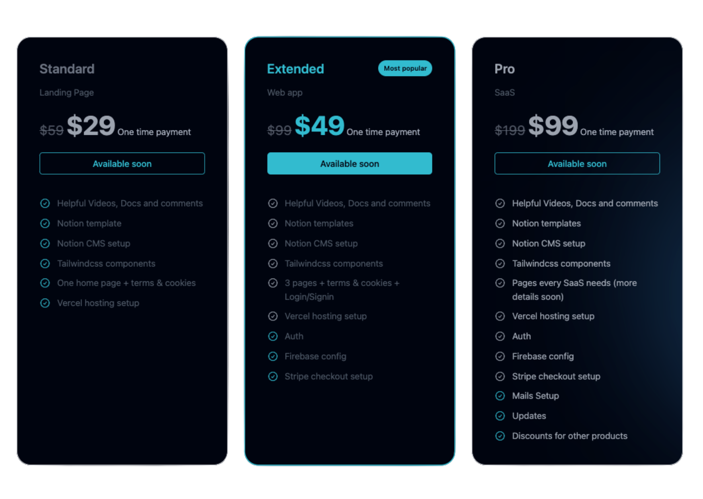

# NotionFlow Launch Page

## What is NotionFLow?

NotionFlow is a NextJS boilerplate which allows to config and use easily Noiton as a Content Management System (CMS).

## How can I get NotionFlow?

Visit [official page](https://www.notionflow.site/) and join the waitlist to gain 50% discount

## What Versions are available?

NotionFlow supports for now three versions:

<h2>Contact</h2>
    
Join ModernDevelopers on Discord:

    
 
Mail:

<a href="mailto:hernackikacper@gmail.com" className="text-blue-600 hover:text-blue-800">💌 hernackikacper@gmail.com</a>
 
Newsletter:

<a href="newsletter.moderndev.io" className="text-blue-600 hover:text-blue-800">💌 Moderndev's newsletter</a>

## Tech

This template provides a minimal setup to get React working in Vite with HMR and some ESLint rules.
Currently, two official plugins are available:

- [@vitejs/plugin-react](https://github.com/vitejs/vite-plugin-react/blob/main/packages/plugin-react/README.md)
  uses [Babel](https://babeljs.io/) for Fast Refresh
- [@vitejs/plugin-react-swc](https://github.com/vitejs/vite-plugin-react-swc) uses [SWC](https://swc.rs/) for Fast
  Refresh
